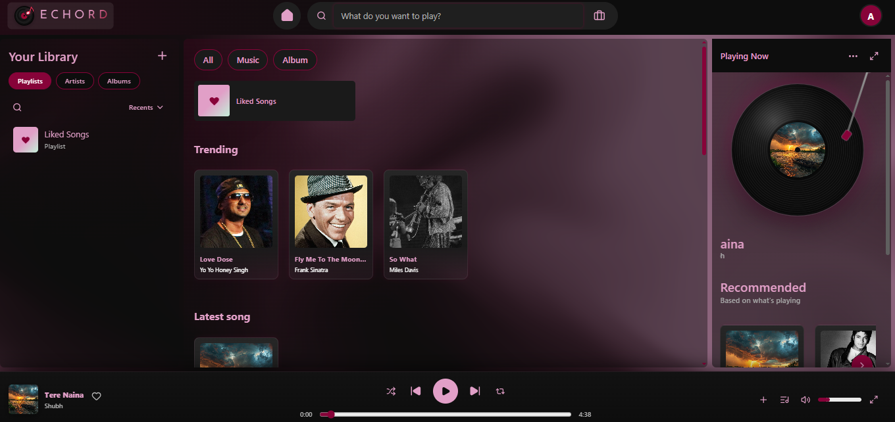
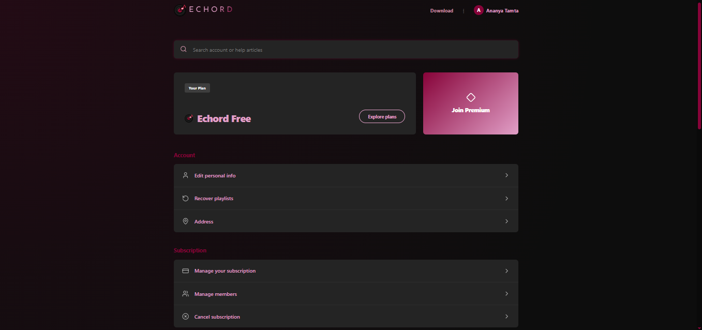
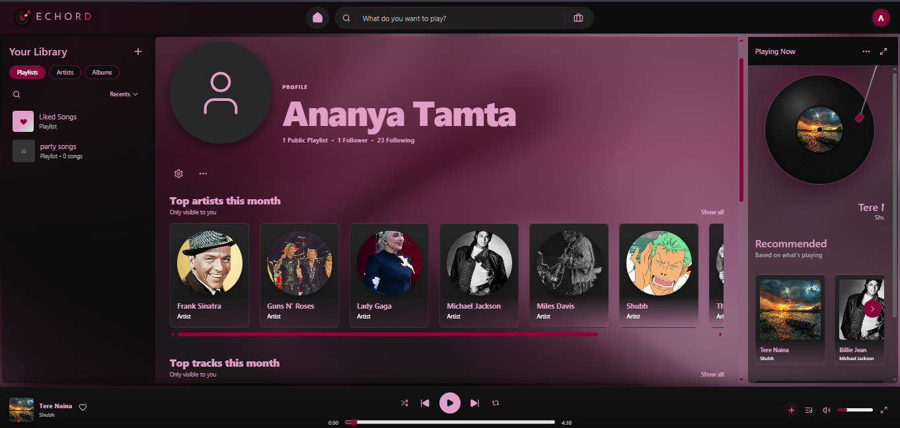
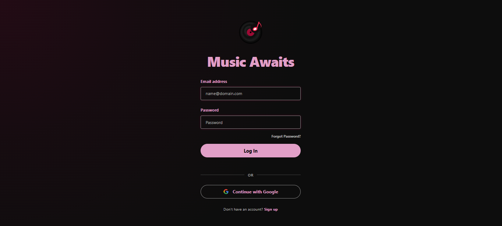

<div align="center">


### Echo Beyond the Beat.

ECHORD is a full-stack music streaming platform built for listeners and creators alike — stream your favorite tracks, build playlists that match your mood, and discover new sounds with personalized listening through intelligent music recommandations, real-time trending charts. Designed with a focus on seamless user experience, ECHORD brings together secure authentication, real-time music playback, and an intuitive interface that makes discovering and organizing music effortless. Whether you're curating the perfect playlist for a late-night drive or exploring what's trending today, ECHORD adapts to how you listen — and for creators, it offers a dedicated space to share their work with a growing community of listeners.


</div>

---
## 🌐 Access ECHORD

- 🌍 **Web:** Experience ECHORD Live at https://echord-songs.vercel.app
- 📱 **Android:** Built with **Capacitor**, providing a native Android experience while leveraging the same web application.

  *Highlights:*
- 📱 Native Android application powered by Capacitor
- 🔄 Shared codebase with the web application
- ⚡ Consistent user experience across web and mobile
- 🎵 Supports the complete music streaming experience on Android devices
- 🔗 Seamless integration with native Android capabilities through Capacitor plugins

## 📖 Table of Contents

- [Features](#-features)
- [Inside the Groove](#inside-the-groove)
- [Tech Stack](#-tech-stack)
- [Project Structure](#-project-structure)
- [Getting Started](#-getting-started)
- [API Overview](#-api-overview)
- [Roadmap](#-roadmap)
- [Contributing](#-contributing)
- [Contact](#-contact)

---

## ✨ Features

- 🔐 **Secure Authentication** — JWT-based login/signup with encrypted passwords
- 🎵 **Real-Time Playback** — Stream tracks with a responsive, low-latency player
- 📂 **Playlist Management** — Create, edit, reorder, and share custom playlists
- 🔥 **Trending & Discovery** — Personalized recommendations and trending charts
- 🎤 **Creator Tools** — Upload and manage original tracks as a creator
- 📱 **Responsive UI** — Built with React for a smooth experience across devices
- 🔍 **Search** — Fast search across tracks, artists, and playlists

---

## Inside the Groove


<table align="center">
  <tr>
    <td align="center"><b>Home</b></td>
    <td align="center"><b>Account</b></td>
  </tr>
  <tr>
    <td></td>
    <td></td>
  </tr>

  <tr>
    <td align="center"><b>Profile</b></td>
    <td align="center"><b>Authentication</b></td>
  </tr>
  <tr>
    <td></td>
    <td></td>
  </tr>

   <tr>
  <td colspan="2" align="center"><b>Creator Dashboard</b></td>
</tr>
<tr>
  <td colspan="2" align="center">
    
  </td>
</tr>
</table>

---

## 🛠 Tech Stack

**🎨Frontend**
- [React](https://react.dev/) — component-based UI
- [Vite](https://vitejs.dev/) — fast build tool and development server
- Plain component state / props for now (no global state manager like Redux yet)


**⚙️ Backend**
- [Node.js](https://nodejs.org/) — JavaScript runtime
- [Express](https://expressjs.com/) — REST API framework
- `dotenv` — environment variable management
- `cors` — cross-origin request handling

**🗄️Database**
- [MySQL](https://www.mysql.com/) — relational database
- Data access via raw SQL / `mysql2` driver 


**🔐Authentication**
- **Secure Authentication** — JWT-based login/signup with encrypted passwords
- **Google Social Login** — Sign in with Google OAuth
- **Email Services** — Email verification and password reset using Nodemailer
- **Session Management** — Secure user session handling with JWT authentication 


**☁️Audio Storage & Streaming**
- [Backblaze B2](https://www.backblaze.com/cloud-storage) — object storage for audio files and cover art
- Audio served/streamed via signed URLs or direct streaming endpoints from B2

*🚀 *Hosting & Deployment**
- [Vercel](https://vercel.com/) — frontend hosting & deployment
- [Railway](https://railway.app/) — backend hosting & deployment
- [Render](https://render.com/) — backend hosting & deployment
- MySQL database hosted alongside backend deployment

### 🛠️ Tools
- Git — Version control
- GitHub — Source code hosting
- VS Code / Antigravity IDE — Development environment

---


## 📁 Project Structure

```text
ECHORD/
├── android/
├── backend/
│   ├── controllers/
│   ├── routes/
│   ├── scripts/
│   ├── services/
│   ├── uploads/
│   ├── .env
│   ├── authController.js
│   ├── authMiddleware.js
│   ├── db.js
│   ├── server.js
│   └── test-auth.js
├── database/
│   ├── schema.sql
│   └── seed.sql
├── dist/
│   ├── assets/
│   ├── 404.html
│   ├── index.html
│   └── logo.svg
├── node_modules/
├── public/
│   ├── 404.html
│   └── logo.svg
├── scratch/
├── src/
│   ├── assets/
│   │   ├── Screenshots/
│   │   ├── logo.svg
│   │   └── music-placeholder.jpg
│   ├── components/
│   │   ├── AlbumsView/
│   │   ├── Auth/
│   │   ├── BrowseView/
│   │   ├── cards/
│   │   ├── CreatePlaylistModel/
│   │   ├── EditPlaylistModel/
│   │   ├── ExpandedPlayer/
│   │   ├── Header/
│   │   ├── HistoryView/
│   │   ├── LibrarySidebar/
│   │   ├── MainPage/
│   │   ├── PlayerBar/
│   │   ├── PlaylistCover/
│   │   ├── PlaylistsView/
│   │   ├── PlaylistView/
│   │   ├── Profile/
│   │   ├── QueueView/
│   │   ├── RightSidebar/
│   │   ├── SearchDropdown/
│   │   ├── shaderBackground/
│   │   ├── SongsList/
│   │   ├── ui/
│   │   ├── Footer.jsx
│   │   └── SignUp.css
│   ├── context/
│   ├── data/
│   ├── services/
│   ├── styles/
│   │   └── global.css
│   ├── App.jsx
│   ├── App.module.css
│   └── main.jsx
├── .env
├── .gitignore
├── capacitor.config.json
├── import_to_railway.js
├── index.html
├── package-lock.json
├── package.json
├── README.md
├── vercel.json
└── vite.config.js
```

## 🚀 Getting Started

### Prerequisites

- Node.js (v18+ recommended)
- MySQL (v8+)
- npm or yarn

### Installation

1. **Clone the repository**
   ```bash
   git clone https://github.com/your-username/echord.git
   cd echord
   ```

2. **Install backend dependencies**
   ```bash
   cd server
   npm install
   ```

3. **Install frontend dependencies**
   ```bash
   cd ../client
   npm install
   ```

4. **Set up the database**
   ```bash
   mysql -u root -p < server/database/schema.sql
   ```

5. **Configure environment variables**
   Copy `.env.example` to `.env` in the `server` directory and fill in your values (see below).

6. **Run the app**

   Backend:
   ```bash
   cd server
   npm run dev
   ```

   Frontend:
   ```bash
   cd client
   npm start
   ```

7. Open [http://localhost:5173](http://localhost:5173) in your browser.

---


## 🔌 API Overview

| Method | Endpoint                   | Description                 |
|--------|----------------------------|-----------------------------|
| POST   | `/api/auth/Signup  `       | Register a new user         |
| POST   | `/api/auth/login`          | Log in and receive a JWT    |
| GET    | `/api/auth/google`         | Google OAuth authentication |
| GET    | `/api/auth/forgot-password`| Send password reset email   |
| POST   | ` /api/auth/reset-password`| Reset user password         |
| GET    | `/api/songs`               | Retrieve songs              |
| GET    | `/api/recommendations`     | Get recommended songs       |
| GET    | `/api/playlists `          | Retrieve user playlists     |
| GET    | `/api/playlists `          | Create a playlis            |
| GET    | `/api/playlists/:id`       | Update a playlist           |
| GET    | `/api/playlists/:id`       | Delete a playlist           |
| GET    | `/api/files/upload`        | Upload audio or cover image |

---

## 🗺 Roadmap

- [ ] Social features (follow creators, comment on tracks)
- [ ] Offline listening
- [ ] Mobile app (React Native)
- [ ] AI-powered recommendation engine

---

## 🤝 Contributing

Contributions are welcome!

1. Fork the repo
2. Create your feature branch (`git checkout -b feature/amazing-feature`)
3. Commit your changes (`git commit -m 'Add amazing feature'`)
4. Push to the branch (`git push origin feature/amazing-feature`)
5. Open a Pull Request

---

## 📬 Contact

This project was developed by:


- [Aashi](https://github.com/Aash1B)
- [Ananya Tamta](https://github.com/Ananya-2026)
- [Kritagya Arora](https://github.com/Kritagyaaa)
- [Shubham Katyan](https://github.com/shubhamkatyan1324)

For any queries, feel free to open an issue in this repository or contact any of the team members.


---

<div align="center">

Made with 🎧 and a lot of ☕

</div>
